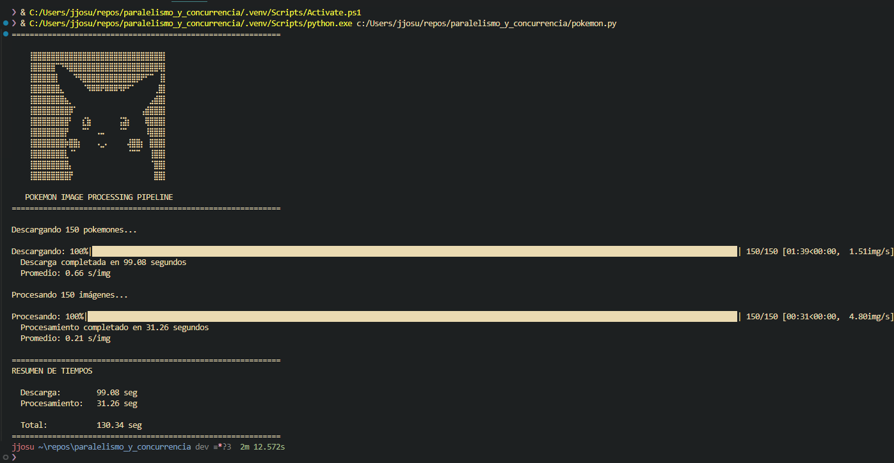
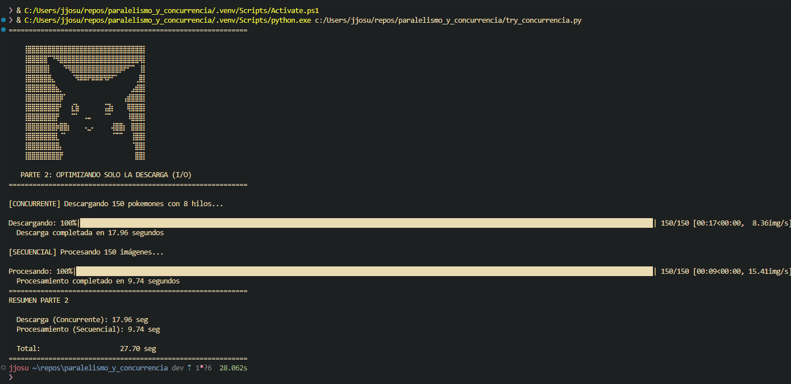
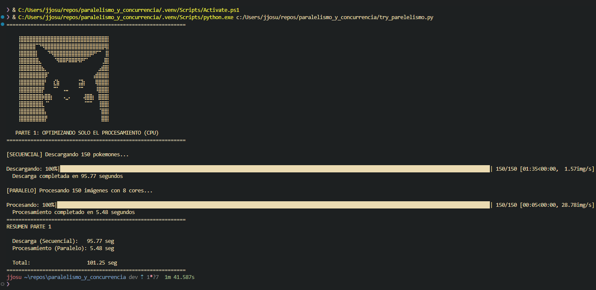
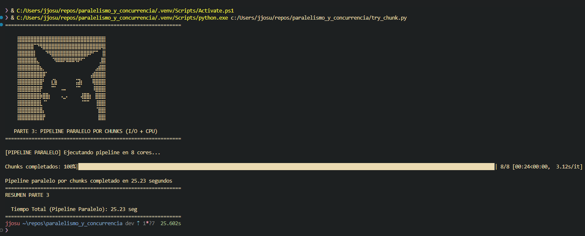
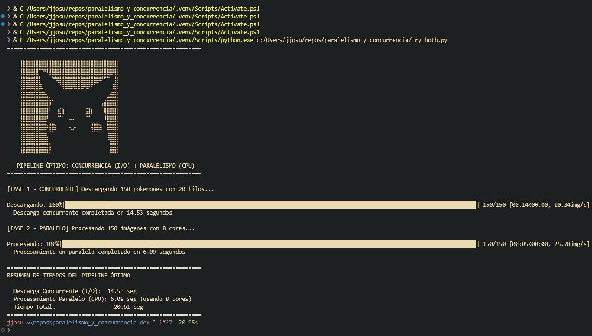

# Optimización de Poke-Pipe

Este proyecto demuestra y compara diferentes técnicas de optimización (concurrencia y paralelismo) para un pipeline de procesamiento de imágenes de Pokémon. El objetivo es mostrar cómo la elección de la estrategia correcta puede reducir drásticamente el tiempo de ejecución de tareas comunes de E/S (I/O-Bound) y de uso intensivo de CPU (CPU-Bound).


---

## 📂 Estructura del Proyecto

```
.
├── evidencia_grafica/
│   ├── concurrencia.png
│   ├── paralelismo.png
│   ├── pokemon.png
│   ├── chunk.png
│   └── both.png
├── pika_banner.py
├── pipeline_1_secuencial.py
├── pipeline_2_concurrente.py
├── pipeline_3_paralelo.py
├── pipeline_4_chunks.py
├── pipeline_5_optimo.py
├── README.md
└── requirements.txt
```

---

## Instalación y Configuración

Para ejecutar las pruebas de este proyecto, primero clona el repositorio y luego instala las dependencias necesarias.

1.  **Crea un entorno virtual (recomendado):**
    ```bash
    python -m venv venv
    source venv/Scripts/activate
    ```

2.  **Creo un archivo `requirements.txt`** con el siguiente contenido:

    ```txt
    requests
    Pillow
    tqdm
    ```

3.  **Instala las dependencias:**
    ```bash
    pip install -r requirements.txt
    ```

---

## Análisis de Estrategias y Resultados

Se evaluaron cinco estrategias diferentes para ejecutar el pipeline de descarga y procesamiento de 150 imágenes.

### Estrategia 1: Script Original (Secuencial)

-   **Descripción:** El enfoque base. Tanto la descarga como el procesamiento de imágenes se ejecutan en un único hilo, una tarea después de la otra.
-   **Análisis:** Es la implementación más simple pero también la más lenta. El tiempo total es la suma de todas las esperas de red y todos los cálculos de la CPU, sin ningún tipo de solapamiento.
-   **Resultado:**
    

### Estrategia 2: Concurrencia en la Descarga

-   **Descripción:** Se optimiza la fase de descarga (I/O-Bound) utilizando un `ThreadPoolExecutor`. Múltiples hilos realizan peticiones de descarga simultáneamente, solapando los tiempos de espera de la red. El procesamiento sigue siendo secuencial.
-   **Análisis:** El tiempo de descarga se reduce drásticamente. Sin embargo, el tiempo de procesamiento sigue siendo un cuello de botella significativo.
-   **Resultado:**
    

### Estrategia 3: Paralelismo en el Procesamiento

-   **Descripción:** Se optimiza la fase de procesamiento (CPU-Bound) utilizando un `ProcessPoolExecutor`. Múltiples imágenes son procesadas simultáneamente en diferentes núcleos de la CPU. La descarga sigue siendo secuencial.
-   **Análisis:** El tiempo de procesamiento se reduce drásticamente, pero la descarga secuencial ahora se convierte en el principal cuello de botella.
-   **Resultado:**
    

### Estrategia 4: Pipeline Paralelo por Chunks

-   **Descripción:** Un intento de paralelizar todo el pipeline. El conjunto de 150 imágenes se divide en 8 "chunks". Se lanzan 8 procesos, y cada uno es responsable de descargar y procesar su propio chunk de imágenes.
-   **Análisis:** Aunque es más rápido que el enfoque secuencial, no es óptimo. Los núcleos de la CPU están mayormente inactivos durante la fase de descarga de cada chunk, lo que representa un desperdicio de recursos de cómputo, a base de esto se opta por el metodo both y se aumentan los hilos de descarga a 20.
-   **Resultado:**
    

### Estrategia 5: Pipeline Óptimo (Concurrencia + Paralelismo)

-   **Descripción:** La solución ideal. Combina las dos mejores estrategias:
    1.  **Fase 1 (I/O):** Se utiliza un `ThreadPoolExecutor` con 20 hilos para descargar todas las imágenes de forma concurrente, minimizando el tiempo de espera de la red.
    2.  **Fase 2 (CPU):** Una vez descargadas, se utiliza un `ProcessPoolExecutor` con 8 procesos para procesar todas las imágenes en paralelo, maximizando el uso de la CPU.
-   **Análisis:** Este enfoque utiliza la herramienta adecuada para cada tipo de tarea, resultando en el menor tiempo de ejecución total. Minimiza tanto el cuello de botella de E/S como el de CPU.
-   **Resultado:**
    

---

## Tabla Comparativa de Rendimiento

A continuación se presenta una tabla para comparar cuantitativamente los resultados de cada prueba. Rellena esta tabla con los tiempos obtenidos en tu máquina.

| Estrategia | Tiempo de Descarga (s) | Tiempo de Procesamiento (s) | **Tiempo Total (s)** |
| :--- | :---: | :---: | :---: |
| 1. Secuencial | 99.08 | 31.26 | **130.34** |
| 2. Concurrencia (I/O) | **17.96** | 9.74| **22.70** |
| 3. Paralelismo (CPU) | 95.77 | **5.48** | **101.25** |
| 4. Pipeline por Chunks | (N/A) | (N/A) | **25.23** |
| 5. Óptimo (Ambos) | **14.53** | **6.09** | **20.61** |

*(Nota: Para el pipeline por chunks, los tiempos no se pueden separar, por lo que solo se mide el total).*

---

## Conclusión

La optimización de un pipeline de datos requiere identificar la naturaleza de sus cuellos de botella:

-   **Para tareas limitadas por E/S (I/O-Bound)**, como descargas o consultas a bases de datos, la **concurrencia con hilos** es la solución más eficiente y ligera.
-   **Para tareas limitadas por la CPU (CPU-Bound)**, como el procesamiento de imágenes, cálculos complejos o machine learning, el **paralelismo con procesos** es la única forma de utilizar múltiples núcleos de CPU y obtener una aceleración significativa en Python.

La combinación secuencial de ambas técnicas, como se demuestra en la **Estrategia 5**, proporciona el mejor rendimiento al especializar cada fase del pipeline con la herramienta de optimización correcta.
```